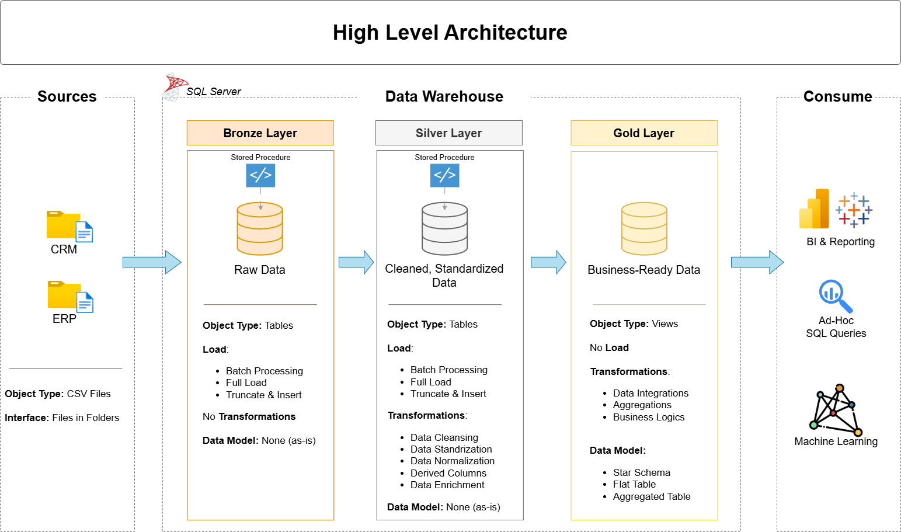

# Data Warehouse and Analytics Project

Welcome to the **Data Warehouse and Analytics Project** repository! 🚀\
This project demonstrates a comprehensive data warehouse and analytics solution, from building a data warehouse to generating actionable insights.

---

## 🏗️ Data Architecture

The data architecture for this project follows Medallion Architecture **Bronze**, **Silver**, and **Gold** layers:

1. **Bronze Layer**: Stores raw data as-is from the source systems. Data is ingested from CSV Files into SQL Server Database.
2. **Silver Layer**: This layer includes data cleansing, standardization, and normalization processes to prepare data for analysis.
3. **Gold Layer**: Houses business-ready data modeled into a star schema required for reporting and analytics.

---

## 📖 Project Overview

This project involves:

1. **Data Architecture**: Designing a Modern Data Warehouse Using Medallion Architecture **Bronze**, **Silver**, and **Gold** layers.
2. **ETL Pipelines**: Extracting, transforming, and loading data from source systems into the warehouse.
3. **Data Modeling**: Developing fact and dimension tables optimized for analytical queries.
4. **Analytics & Reporting**: Creating SQL-based reports and dashboards for actionable insights.

---

## 🚀 Project Requirements

### Building the Data Warehouse (Data Engineering)

#### Objective
Develop a modern data warehouse using SQL Server to consolidate sales data, enabling analytical reporting and informed decision-making.

#### Specifications
- **Data Sources**: Import data from two source systems (ERP and CRM) provided as CSV files.
- **Data Quality**: Cleanse and resolve data quality issues prior to analysis.
- **Integration**: Combine both sources into a single, user-friendly data model designed for analytical queries.
- **Scope**: Focus on the latest dataset only; historization of data is not required.
- **Documentation**: Provide clear documentation of the data model.

---

### BI: Analytics & Reporting (Data Analysis)

#### Objective
Develop SQL-based analytics to deliver detailed insights into:
- **Customer Behavior**
- **Product Performance**
- **Sales Trends**

These insights empower stakeholders with key business metrics, enabling strategic decision-making.  

---

## 📊 Dataset Documentation: Sales Data Warehouse

This dataset is organized into two main data source folders within `datasets/`:

- `datasets/source_crm/`: Contains data extracted from the **Customer Relationship Management (CRM)** system.
- `datasets/source_erp/`: Contains data extracted from the **Enterprise Resource Planning (ERP)** system.

---

### 📁 `datasets/source_crm/` – CRM Data Source

This folder includes customer, product, and sales transaction data.

#### 📄 `cust_info.csv` – Customer Information

| Column Name        | Description |
|--------------------|-------------|
| `cst_id`           | Internal ID of the customer |
| `cst_key`          | Unique customer key used across systems |
| `cst_firstname`    | First name of the customer |
| `cst_lastname`     | Last name of the customer |
| `cst_marital_status` | Marital status (e.g., Single, Married) |
| `cst_gndr`         | Gender (e.g., M for Male, F for Female) |
| `cst_create_date`  | Date the customer was added to the system |

---

#### 📄 `prd_info.csv` – Product Information

| Column Name       | Description |
|-------------------|-------------|
| `prd_id`          | Internal product ID |
| `prd_key`         | Unique product key |
| `prd_nm`          | Product name |
| `prd_cost`        | Product cost (unit production cost) |
| `prd_line`        | Product line or category |
| `prd_start_dt`    | Product start date (available for sale) |
| `prd_end_dt`      | Product end date (discontinued, if any) |

---

#### 📄 `sales_details.csv` – Sales Transactions

| Column Name       | Description |
|-------------------|-------------|
| `sls_ord_num`     | Sales order number |
| `sls_prd_key`     | Product key |
| `sls_cust_id`     | Customer ID |
| `sls_order_dt`    | Date the order was placed |
| `sls_ship_dt`     | Date the order was shipped |
| `sls_due_dt`      | Due date for payment |
| `sls_sales`       | Total sales amount for the order |
| `sls_quantity`    | Quantity of products sold |
| `sls_price`       | Unit price of the product sold |

---

### 📁 `datasets/source_erp/` – ERP Data Source

This folder contains extended customer demographics, locations, and product category data.

#### 📄 `cust_az12.csv` – Customer Demographics

| Column Name | Description |
|-------------|-------------|
| `CID`       | Customer ID|
| `BDATE`     | Customer birthdate |
| `GEN`       | Gender (Male/Female) |

---

#### 📄 `loc_a101.csv` – Customer Location

| Column Name | Description |
|-------------|-------------|
| `CID`       | Customer ID |
| `CNTRY`     | Country where the customer resides |

---

#### 📄 `px_cat_g1v2.csv` – Product Categories

| Column Name | Description |
|-------------|-------------|
| `ID`        | Product ID or reference ID |
| `CAT`       | Main product category (e.g., Electronics, Apparel) |
| `SUBCAT`    | Sub-category (e.g., Mobile Phones, Shoes) |
| `MAINTENANCE` | Maintenance or version info of the product category |

---

## 🛡️ License

This project is licensed under the [MIT License](LICENSE). You are free to use, modify and share this project with proper attribution.
